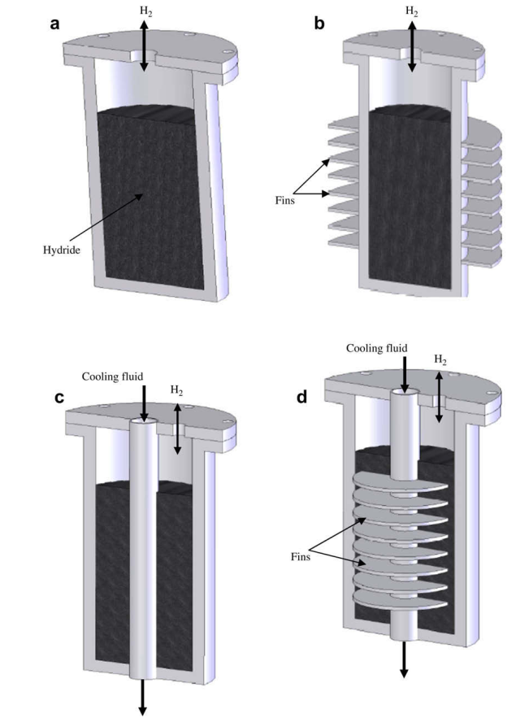

# Notas de Lectura: Optimization of hydrogen storage in metal-hydride tanks

**Autor:** [F. Askri, M. Ben Salah, A. Jemni, S. Ben Nasrallah]
**Referencia BibTeX:** `[cijhydene_2008]`
**Fecha de Publicación:** [2008]

---

## 1. Resumen y Propósito del Artículo

Este artículo se enfoca en la optimización del tiempo de almacenamiento de hidrógeno en tanques de hidruro metálico (MHT). Para esto, se desarrolló un modelo matemático bidimensional validado con resultados experimentales. El estudio evalúa el impacto de la masa térmica de la pared del tanque y compara distintos diseños para mejorar la transferencia de calor, ya que esta es la principal limitación del proceso de absorción de hidrógeno. Se concluye que las aletas externas y los tubos internos son los diseños más efectivos para mejorar el almacenamiento.

## 2. Imagen de Referencia

## 3. Puntos Clave y Datos

### Aspectos Principales

i) un tanque cilíndrico,
ii) un tanque cilíndrico con aletas externas,
iii) un tanque cilíndrico con un tubo concéntrico lleno de hidruros metálicos con fluido refrigerante fluyendo
iv) un tanque cilíndrico con un tubo concéntrico equipado con aletas

**Problema principal**: El factor limitante para la absorción de hidrógeno en tanques de hidruro metálico es la tasa de remoción de calor de la reacción.

**Modelo matemático:** Se utilizó un modelo matemático en 2D para simular el proceso y optimizar los diseños del tanque.

**Diseños analizados:** El estudio comparó el rendimiento de cuatro diseños: un tanque cilíndrico simple, un tanque con aletas externas, un tanque con tubos concéntricos llenos de fluido refrigerante y un tanque con tubos U.

**Mejoras en el diseño:** Los resultados muestran que los diseños con aletas y tubos internos mejoran significativamente la transferencia de calor, lo que reduce el tiempo de almacenamiento.

## 4. Caracterizacion Basica

**Configuracion geometrica** : Cilíndrica

**Dimensiones** :
  Longitud: 8 cm
  Diámetro: 8 cm (interior 6 cm)
  Volumen:
  Otras medidas relevantes: Espesor del Lecho 6 cm

**Condiciones de Operacion** :
  Temperatura: 350 K
  Presión: 8 bar
  Flujo:
  Otras condiciones relevantes: paredes acero y laton

## 5. Tranferencia de Calor

  Diametro de las aletas : 1/4 0,02 y 0,025
  Materiales y propiedades térmicas
  Eficiencia térmica
  
## 6. MH Hidruro Metalico

  Tipo de hidruro: LaNi5
  Densida: 8200 kg/m3
  Propiedades
  Comportamiento
  Características especiales

## 7. Conclusiones y Observaciones

  Muestra los cuatro diseños del tanque: (a) cilíndrico simple, (b) con aletas externas, (c) con tubos concéntricos para refrigerante, y (d) con tubos en U para refrigerante.

## 8. Referencias Adicionales

---

### Notas Adicionales

| Figura | Descripción | Detalles clave |
|---|---|---|
| 1 | Esquema de las configuraciones del tanque de hidruro metálico. | Muestra los cuatro diseños del tanque: (a) cilíndrico simple, (b) con aletas externas, (c) con tubos concéntricos para refrigerante, y (d) con tubos en U para refrigerante.|
| 5 | Curvas de presión de absorción vs. tiempo. | Muestra la variación de la presión del gas de hidrógeno para los diferentes diseños de tanques. |
| 7 | Curvas de temperatura del lecho vs. tiempo. | Ilustra cómo la temperatura del lecho de hidruro cambia con el tiempo para los distintos diseños, demostrando la mejora en la transferencia de calor |
| 8 | Variación de la fracción de hidrógeno con el tiempo. | Compara la cantidad de hidrógeno absorbido por el hidruro a lo largo del tiempo para cada diseño |
| 9 | Curvas isotérmicas en el lecho del reactor. | Muestra la distribución de temperatura dentro del tanque, lo cual es fundamental para el análisis de transferencia de calor.|
| 12 | Variación de la velocidad del flujo de hidrógeno. | Se utiliza para analizar el movimiento del hidrógeno dentro del lecho.|
