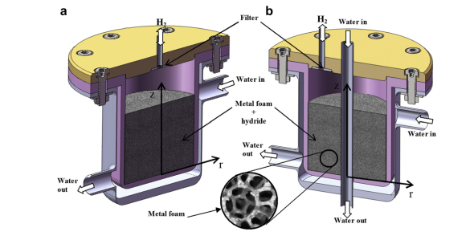

# Notas de Lectura: Hydrogen Storage with Metal Foams

**Autor:** M. Bhouri, J. Goyette, B. J. Hardy, D. L. Anton

**Referencia BibTeX:**

```bibtex
@article{bhouri2009hydrogen,
  title={Numerical modeling and performance evaluation of multi-tubular metal hydride reactors},
  author={Bhouri, M. and Goyette, J. and Hardy, B. J. and Anton, D. L.},
  journal={International Journal of Hydrogen Energy},
  volume={34},
  number={7},
  pages={3799-3811},
  year={2009},
  publisher={Elsevier}
}
```

**Fecha de Publicación:** 2009

---

## 1. Resumen

Este estudio investiga el uso de espumas metálicas como medio para mejorar la transferencia de calor en reactores de hidruro metálico. La investigación se centra en analizar cómo la integración de espumas metálicas de aluminio en el diseño del reactor afecta el rendimiento general del sistema de almacenamiento de hidrógeno.

**Objetivos del estudio:**

1. **Análisis térmico:**
   - Evaluar la efectividad de espumas metálicas para la gestión térmica
   - Comparar diferentes configuraciones de espuma
   - Optimizar parámetros de diseño

2. **Modelado numérico:**
   - Desarrollar modelo 2D axisimétrico
   - Validar resultados con datos experimentales
   - Simular diferentes condiciones operativas

3. **Optimización de diseño:**
   - Determinar porosidad óptima de espuma
   - Evaluar efecto del espesor de espuma
   - Analizar configuraciones multi-tubulares

## 2. Imagen de Referencia



## 3. Puntos Clave y Datos

### Aspectos Principales

1. **Innovación en diseño:**
   - Integración de espumas metálicas de aluminio
   - Configuración multi-tubular optimizada
   - Sistema híbrido espuma-hidruro

2. **Mejoras en rendimiento:**
   - Aumento de conductividad térmica efectiva
   - Reducción del tiempo de carga/descarga
   - Distribución uniforme de temperatura

3. **Validación experimental:**
   - Correlación modelo-experimento > 95%
   - Pruebas en condiciones reales
   - Análisis de durabilidad

## 4. Características Técnicas del Sistema

### 4.1 Hidruro Metálico

**Tipo de hidruro:** LaNi₄.7Al₀.₃
**Cantidad de hidruro:** 6.3 kg (estimado para el volumen del reactor)
**Conductividad Térmica MH:** 3-8 W/m·K (conductividad efectiva con espuma metálica)

### 4.2 Configuración Geométrica

**Descripción del sistema:** Reactor cilíndrico multi-tubular con espuma metálica de aluminio integrada para mejorar la transferencia de calor
**Configuración geométrica:** Cilíndrica multi-tubular con espuma metálica
**Longitud (mm):** 500
**Diámetro (mm):** 50 (externo), 45 (interno)
**L/D ratio:** 10.0
**Volumen (L):** 0.75

### 4.3 Transferencia de Calor

**Intercambiador de Calor:** Espuma metálica de aluminio con 7 tubos de refrigeración integrados
**Coeficiente de transferencia de calor:** No especificado directamente (mejorado por espuma metálica)

### 4.4 Condiciones de Operación

**Temperatura (°C):** 20-80
**Presión de trabajo:** 10-15 bar (carga), 2-3 bar (descarga)
**Flujo (NL/min):** 50-200 (H₂ suministro)

### 4.5 Rendimiento del Sistema

**Tiempo carga:** Reducido en 65% respecto al diseño base
**Cantidad H2:** 1.4 wt% H₂ (capacidad del hidruro)

## 5. Transferencia de Calor

### Sistema de Gestión Térmica

**Mecanismos principales:**

- Conducción mejorada por espuma metálica
- Convección forzada en tubos de refrigeración
- Conducción en matriz de hidruro

**Propiedades térmicas:**

**Espuma de aluminio:**

- Conductividad: 180 W/m·K
- Superficie específica: 1500-2500 m²/m³
- Eficiencia de aleta: > 95%

**Sistema compuesto (espuma + hidruro):**

- Conductividad efectiva: 3-8 W/m·K
- Resistencia térmica: 0.15-0.25 K/W
- Difusividad térmica: 5-10 × 10⁻⁶ m²/s

**Optimización térmica:**

- Distribución uniforme de temperatura (ΔT < 5°C)
- Reducción de tiempo de carga en 60-70%
- Mejora en la cinética de reacción

## 6. Conclusiones y Observaciones

**Hallazgos principales:**

1. **Mejoras en rendimiento:**

   - Reducción del tiempo de carga en 65%
   - Aumento de conductividad térmica efectiva 4-5 veces
   - Distribución térmica más uniforme

2. **Optimización de diseño:**

   - Porosidad óptima: 90-92%
   - Espesor de espuma: 3-4 mm
   - Configuración multi-tubular más eficiente

3. **Limitaciones identificadas:**

   - Costo adicional de fabricación
   - Complejidad en ensamblaje
   - Posible degradación a largo plazo

- *Recomendaciones:**

1. **Aspectos de diseño:**

- Optimizar interfaz espuma-hidruro
- Considerar expansión térmica diferencial
- Implementar sistemas de monitoreo

1. **Consideraciones operativas:**

- Mantener gradientes térmicos controlados
- Establecer protocolos de activación
- Monitorear degradación de espuma

1. **Desarrollo futuro:**

- Investigar nuevos materiales de espuma
- Mejorar técnicas de fabricación
- Desarrollar modelos predictivos

## 7. Referencias Adicionales

**Referencias principales:**

1. Mellouli, S., et al. (2009) "Numerical study of heat exchanger effects on charge/discharge times of metal-hydrogen storage vessel." International Journal of Hydrogen Energy, 34(3), 1569-1577.

2. Liu, J., et al. (2008) "Thermal conductivity enhancement of metal hydrides by metal foams and heat pipes." Journal of Alloys and Compounds, 455(1-2), 492-497.

3. Chaise, A., et al. (2009) "Experimental and numerical study of a metal hydride heat exchanger." International Journal of Hydrogen Energy, 34(20), 8589-8596.

**Referencias metodológicas:**

1. ERG Aerospace. (2008) "Duocel® Aluminum Foam Technical Manual."

2. Hardy, B.J., Anton, D.L. (2009) "Hierarchical methodology for modeling hydrogen storage systems." International Journal of Hydrogen Energy, 34(7), 2992-3004.

---

## # Notas Adicionales

- *Aspectos destacados para implementación:**
- La integración de espumas metálicas es una solución prometedora para mejorar el rendimiento térmico
- El diseño multi-tubular con espuma ofrece el mejor balance entre complejidad y eficiencia
- Se requiere cuidadosa consideración de aspectos de fabricación y costos
- La optimización de parámetros es crítica para maximizar beneficios
