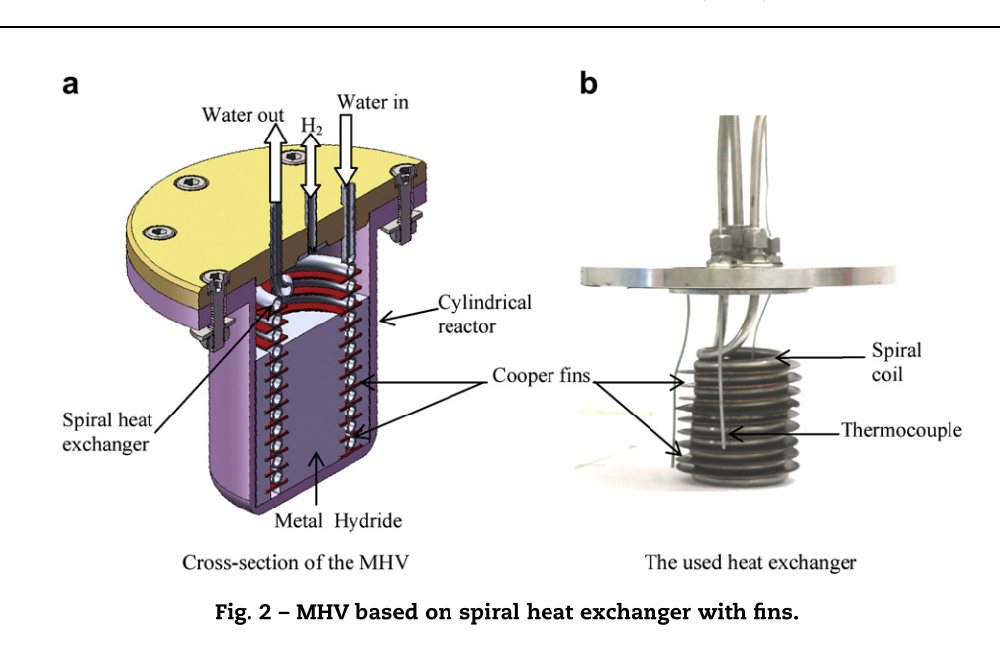

# Notas de Lectura: Experimental study of a metal hydride vessel based on a finned spiral heat exchanger

**Autor:** Dhaou, H. and Souahlia, A. and Mellouli, S. and Askri, F. and Jemni, A. and Ben Nasrallah, S.

**Referencia BibTeX:** `Dhaou2010`

**Fecha de Publicación:** 2010

---

## 1. Resumen

El artículo presenta un estudio experimental sobre el desempeño de un recipiente de hidruro metálico (MHV) equipado con un intercambiador de calor en espiral con aletas. El objetivo principal es analizar cómo la geometría del intercambiador y las condiciones de operación (flujo y temperatura del fluido de enfriamiento, presión aplicada y volumen del tanque de hidrógeno) afectan los tiempos de carga (absorción) y descarga (desorción) del hidruro metálico.

## 2. Imagen de Referencia

## 3. Puntos Clave y Datos

### Aspectos Principales

- El desempeño del MHV depende principalmente de la transferencia de calor entre el lecho de hidruro y el fluido de intercambio
- Se compararon dos configuraciones:
  - C1: Intercambiador externo coaxial
  - C2: Intercambiador en espiral con aletas inmerso en el lecho de hidruro
- La configuración C2 redujo el tiempo para almacenar 4 g de H₂ de 3700 s a 1000 s
- La absorción y desorción mejoran al aumentar la presión de suministro y al disminuir la temperatura del fluido refrigerante

## 4. Características Técnicas del Sistema

### 4.1 Hidruro Metálico

**Tipo de hidruro:** LaNi₅
**Cantidad de hidruro:** 1.0 kg
**Conductividad Térmica MH:** 1.2 W/m·K (efectiva con aletas de cobre)

### 4.2 Configuración Geométrica

**Descripción del sistema:** Reactor cilíndrico de acero inoxidable 316-L con intercambiador de calor helicoidal con aletas de cobre inmerso en el lecho de hidruro
**Configuración geométrica:** Cilíndrica con intercambiador helicoidal interno
**Longitud (mm):** 110 (altura interna)
**Diámetro (mm):** 80 (interno), 110 (externo)
**L/D ratio:** 1.375
**Volumen (L):** 0.552

### 4.3 Transferencia de Calor

**Intercambiador de Calor:** Tubo helicoidal con aletas de cobre (11 vueltas, paso 7 mm, diámetro de hélice 50 mm)
**Coeficiente de transferencia de calor:** Mejorado significativamente por aletas de cobre

### 4.4 Condiciones de Operación

**Temperatura (°C):** 100
**Presión de trabajo:** 10 bar
**Flujo (NL/min):** 780 NL/min (convertido de 13 g/s)

### 4.5 Rendimiento del Sistema

**Tiempo carga:** 1000 s (configuración C2), 3700 s (configuración C1)
**Cantidad H2:** 4 g H₂ (~1.4 wt%)

## 5. Transferencia de Calor

**Métodos de transferencia de calor utilizados:**

- Convección forzada mediante fluido térmico circulante dentro del tubo helicoidal
- Conducción mejorada por aletas de cobre
- Intercambiador en espiral inmerso en el lecho

**Materiales y propiedades térmicas:**

- Tubo intercambiador: Acero inoxidable 316-L
- Aletas: Cobre (alta conductividad térmica)
- Configuración helicoidal optimizada

**Eficiencia térmica:**

- Reducción del tiempo de carga en ~70%
- Temperatura del lecho mantenida baja favoreciendo la absorción
- Mejora significativa en cinética de reacción

**Problemas y soluciones relacionados con el manejo térmico:**

- Problema: Limitada conductividad del polvo de hidruro
- Solución: Uso de aletas de cobre y configuración helicoidal interna
- Resultado: Mejora notable en transferencia de calor

## 6. Conclusiones y Observaciones

**Resultados principales:**

1. **Mejoras en rendimiento:**

- El diseño de intercambiador en espiral con aletas (C2) mejora notablemente la cinética de absorción y desorción
- Reducción del tiempo de carga de 3700s a 1000s (73% de mejora)
- La transferencia de calor es el factor más crítico para el rendimiento del MHV

1. **Optimización de diseño:**

- La configuración helicoidal con aletas es superior al intercambiador externo
- Las aletas de cobre proporcionan conductividad térmica mejorada
- El enfriamiento interno es más efectivo que el externo

1. **Parámetros operativos:**

- La optimización de parámetros operativos (flujo, temperatura y presión) puede reducir los tiempos de carga/descarga hasta en un 70%
- Presión de suministro más alta mejora la absorción
- Temperatura de refrigerante más baja favorece el proceso

**Recomendaciones:**

- Implementar diseños de intercambiador internos con aletas
- Optimizar la geometría helicoidal para maximizar área de transferencia
- Controlar cuidadosamente las condiciones operativas

## 7. Referencias Adicionales

Referencias relacionadas para futura investigación en diseño térmico de reactores de hidruros metálicos.

---

### Notas Adicionales

Este trabajo sirve como referencia clave para el diseño térmico de reactores de hidruros metálicos, especialmente en sistemas de almacenamiento de hidrógeno de alta eficiencia. Proporciona datos experimentales útiles para validación de modelos de transferencia de calor y masa en materiales como LaNi₅.
