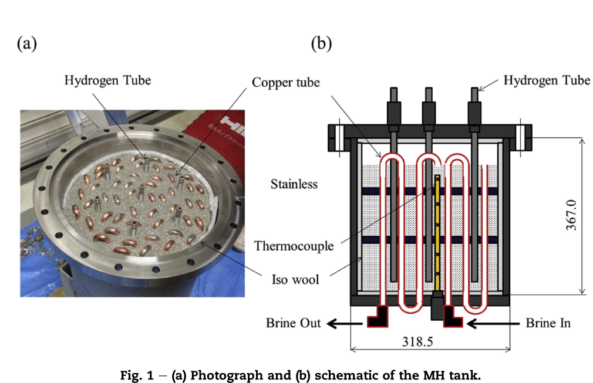

# Notas de Lectura: Operation of a bench-scale TiFe-based alloy tank under mild conditions for low-cost stationary hydrogen storage

**Autor:** [Naruki Endo, Satoshi Suzuki, Kiyotaka Goshome, Tetsuhiko Maeda]

**Referencia BibTeX:** `[Endo2017]`

**Fecha de Publicación:** [2017]

---

## 1. Resumen y Propósito del Artículo

El estudio analiza el funcionamiento de un tanque de hidruro metálico a escala piloto (bench-scale) relleno con 55 kg de aleación TiFeMn, diseñado para almacenamiento estacionario de hidrógeno a bajo costo y bajo condiciones moderadas (≤1 MPa y ≤80 °C).

## 2. Imagen de Referencia

## 3. Puntos Clave y Datos

### Aspectos Principales

La activación completa del TiFe requirió 7 ciclos de absorción/desorción (284 h).

Una vez activado, el tanque pudo absorber y desorber más de 8 Nm³ de H₂ bajo flujo constante de 20 NL/min.

La transferencia de calor durante la desorción fue el doble que durante la absorción.

En comparación con el LaNi₅, el tanque TiFe mostró mayor eficiencia térmica y mejor desempeño bajo flujos de hidrógeno altos.

## 4. Caracterizacion Basica

**Configuracion geometrica** : Cilindrica

**Dimensiones** :
    Diámetro: 306 mm
  Altura 700 mm
  Peso total tanque: 70 kg
  Volumen: 20 L
  Otras medidas relevantes:

**Condiciones de Operacion** : [Detallar las condiciones de operación]
  Temperatura: 70 c
  Presión: 1 MPa
  Flujo: 20 NL/min
  
## 5. Tranferencia de Calor

Método: Convección forzada mediante circulación de brina a través de tubos de cobre dentro del lecho de aleación.

Propiedades térmicas:

Cp = 3.85 kJ/kg·K, densidad = 1.02 kg/L.

Eficiencia térmica:

Desorción: q ≈ 570 W → el doble que la absorción (~280 W).

Mayor rendimiento que en el tanque LaNi₅ (461 W en desorción).

Factores críticos:

Menor pulverización de la aleación TiFe mantiene mejor conductividad térmica del lecho.

Pérdidas térmicas externas afectan más durante absorción (proceso exotérmico).

## 6. MH Hidruro Metalico

  Tipo de hidruro: TiFe₀.₈Mn₀.₂ (sustitución parcial de Fe por Mn).
  Propiedades:
  Densidad volumétrica alta.
  Calor de reacción: 33.4 kJ/mol H₂.
  Capacidad: H/M ≈ 0.9 (equivalente a ~1.5 wt%).
  
## 7. Conclusiones y Observaciones

Se demostró la viabilidad del TiFe como material de almacenamiento estacionario bajo condiciones seguras y de bajo costo.

La activación fue larga pero puede optimizarse reduciendo tiempos de vacío y mejorando el tratamiento de reducción.

Una vez activado, el tanque TiFe:

Absorbe/desorbe más de 8 Nm³ H₂ bajo flujo constante de 20 NL/min.

Presenta mejor transferencia de calor que el LaNi₅.

Es más adecuado para operación continua o con altos flujos de H₂.

Se recomienda para sistemas estacionarios de hidrógeno, como almacenamiento de energía renovable o compresión térmica de hidrógeno.

## 8. Referencias Adicionales

Reilly & Wiswall (1974) – Formation and properties of iron titanium hydride.

Bououdina et al. (2009) – Effect of Ni alloying on TiFe hydrogen absorption.

Mellouli et al. (2009) – Hydrogen storage in MH tanks with metal foam exchangers.

Kaplan et al. (2009) – Enhancement of H₂ charging in MH reactors.

---

### Notas Adicionales

Este trabajo es relevante para el desarrollo de sistemas de almacenamiento estacionario de hidrógeno económicos, demostrando que las aleaciones basadas en TiFe pueden reemplazar materiales más costosos como LaNi₅ si se optimizan los procesos de activación y gestión térmica. El enfoque a presión moderada (≤1 MPa) facilita su aplicación en entornos donde las regulaciones de alta presión son restrictivas.
