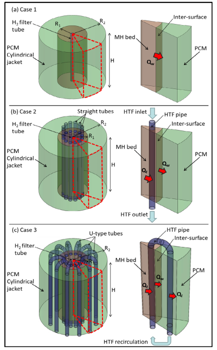

# Notas de Lectura: Impact of using a heat transfer fluid pipe in a metal hydride-phase change material tank

**Autor:** [S. Mellouli, F. Askri, E. Abhilash y S. Ben Nasrallah.]
**Referencia BibTeX:** `[IJHE_2017]`
**Fecha de Publicación:** [2017]

---

## 1. Resumen y Propósito del Artículo

Este estudio evalúa numéricamente la viabilidad de usar un tubo de fluido de transferencia de calor (HTF) en un tanque de hidruro metálico (MH) que integra un intercambiador de calor de material de cambio de fase (PCM). El objetivo es comparar tres configuraciones diferentes para mejorar la transferencia de calor y el rendimiento del almacenamiento de hidrógeno y calor. Se desarrolla un modelo matemático 3D y los resultados computacionales indican que el uso de un tubo HTF en un tanque MH-PCM es un compromiso entre reducir el tiempo de llenado de hidrógeno y comprometer la capacidad de almacenamiento de calor. Se utiliza la aleación de hidruro de magnesio y níquel

## 2. Imagen de Referencia

---

## 3. Puntos Clave y Datos

### Aspectos Principales

Materiales: El estudio utiliza la aleación de hidruro metálico como material de cambio de fase (PCM) para el almacenamiento de calor latente.

Transferencia de calor: La baja conductividad térmica de los hidruros metálicos y los PCMs es el principal problema. Se propone el uso de un tubo de fluido de transferencia de calor (HTF) para acelerar el proceso.

Configuraciones analizadas: Se simulan y comparan tres configuraciones del tanque:

Caso 1 (sin tubo HTF): El hidruro metálico está en contacto directo con el PCM para almacenar todo el calor de reacción.

Caso 2 (con tubo HTF abierto): Se colocan tubos rectos de HTF dentro del tanque. El HTF extrae el calor de la reacción y lo disipa en el ambiente.

Caso 3 (con tubo HTF cerrado): Se utilizan tubos en U que circulan a través del lecho de MH y el dominio de PCM para transferir el calor de reacción directamente al PCM.

Resultados principales: El Caso 2 reduce el tiempo de llenado en un 94% en comparación con el Caso 1, pero disipa el calor como residuo. El Caso 3 reduce el tiempo de llenado en un 72% y almacena todo el calor de reacción en el PCM. El uso de un tubo HTF es un compromiso entre la velocidad de llenado y la capacidad de almacenamiento de calor

## 4. Caracterizacion Basica

**Configuracion geometrica** : Cilindrica

**Dimensiones** :
  Longitud: 164.3 mm
  Diámetro: 180 mm
  Volumen:
  Radio interior material PCM: 40 mm
  Radio de tubos: 6 mm

**Condiciones de Operacion** :
  Temperatura: 580 K
  Presión:
  Flujo: 7600 W/m2
  Otras condiciones relevantes:

## 5. Tranferencia de Calor

Material de cambio de Fase

## 6. MH Hidruro Metalico

  Tipo de hidruro : MH-PCM

## 7. Conclusiones y Observaciones

## 8. Referencias Adicionales

---

### Notas Adicionales

figura 1

1a -> geometria caso 1 Tanque cilíndrico de MH rodeado por una camisa de PCM para el almacenamiento directo de calor de reacción
1b -> Tanque similar al Caso 1, pero con 12 tubos rectos de HTF que extraen el calor para disiparlo en el ambiente caso 2
1c -> Tanque con 12 tubos en forma de U que transfieren el calor de reacción desde el lecho de MH al PCM caso 3
tabla 1 -> Muestra las dimensiones de los diferentes tanques simulados (radios y altura) para cada uno de los tres casos
tabla 2 -> Enumera las propiedades termofísicas del hidruro
