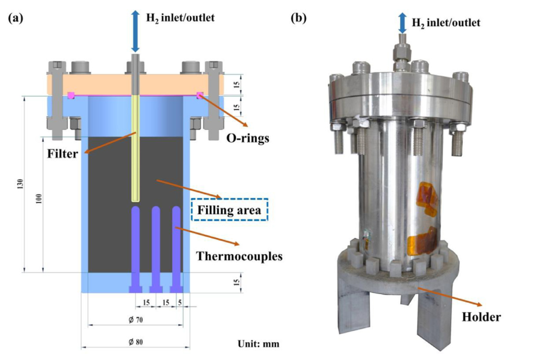

# Notas de Lectura: The relationship between thermal management methods and hydrogen storage performance of the metal hydride tank

**Autor:** [Jianhui Zhu, Xi Lin, Lijun Lv, Mingda Li, Qun Luo, V.N. Kudiiarov, Wei Liu, Haiyan Leng, Xingbo Han, Zhaowei Ma]

**Referencia BibTeX:** `[Zhu J. et al. 2024]`

**Fecha de Publicación:** [2024]

---

## 1. Resumen y Propósito del Artículo

El propósito principal es mejorar el bajo rendimiento de transferencia de calor de los tanques de almacenamiento de hidrógeno de estado sólido, que limita su capacidad para satisfacer los requisitos de suministro de hidrógeno de las pilas de combustible. Los hallazgos clave son que la conductividad térmica efectiva y el área de transferencia de calor de la cama de hidruro metálico (MH) desempeñan un papel crucial. Se concluye que la transferencia de calor es más importante que la transferencia de masa para mejorar el rendimiento del tanque

## 2. Imagen de Referencia

## 3. Puntos Clave y Datos

### Aspectos Principales

La transferencia de calor es el principal factor limitante para la absorción/desorción de H en tanques de hidruros metálicos.

Mejor rendimiento interno: La adición de aletas de cobre aumenta el área de transferencia de calor y supera a la espuma de cobre y al grafito natural expandido.

Mejor rendimiento externo: El enfriamiento por agua es el método externo más efectivo, seguido por el enfriamiento por aire y la convección natural .

Resultado Óptimo: La combinación de ENG + aletas de cobre (Caso 3) con refrigeración por agua logró la saturación en solo 29.4 min1111. Esto representa una reducción del 55.6% en el tiempo de absorción en comparación con el tanque sin aletas de cobre (Caso 1)12.

## 4. Caracterizacion Basica

**Configuracion geometrica** : Cilindrica

**Dimensiones** : [Detallar las dimensiones relevantes]
  Longitud: 130 mm
  Diámetro: 70 mm
  Espesor de la pared: 5 mm
  Altura de llenado (real): 100 mm
  Acero inoxidable 304.

**Condiciones de Operacion** : [Detallar las condiciones de operación]
  Temperatura: 67 C
  Presión: 2  MPa
  Flujo: 1 NL/min
  
## 5. Tranferencia de Calor

Métodos Internos Utilizados:Caso 1: 95 wt.% MH + 5 wt.% (Grafito Natural Expandido)21.Caso 2: 100 wt.% MH + espuma de cobre22.Caso 3: 95 wt.% MH + 5 wt.% + cinco aletas de cobre (0.5 mm de grosor)23.Métodos Externos Utilizados: Convección natural, refrigeración por aire, y refrigeración por agua24.Gradiente Térmico: Se observó un gradiente de temperatura notable, con la temperatura máxima en el centro del tanque TC1 a r=0) y la más baja cerca de la pared (TC4 a r=40 mm), confirmando la dificultad de evacuar el calor del núcleo25252525.Rendimiento General: La mejora en el rendimiento es más notable cuando se utiliza la combinación de o espuma de Cu con métodos de enfriamiento externo mejorados (aire/agua), lo que indica que el paso limitante pasa de la transferencia de calor externa a la transferencia de calor interna26.

## 6. MH Hidruro Metalico

  Tipo de hidruro: LaNi5
  Masa total: 1150 g

## 7. Conclusiones y Observaciones

La eficiencia de la transferencia de calor interna y externa son determinantes para la absorción de hidrógeno.

El enfriamiento por agua combinado con aletas de cobre proporciona el mejor rendimiento general de transferencia de calor y el tiempo de absorción más rápido.

El estudio experimental confirma que los métodos para aumentar la conductividad térmica efectiva , espuma de Cu y el área de transferencia de calor aletas de Cu son claves para mejorar la velocidad de reacción y el rendimiento del tanque.

El proceso de absorción se divide en 4 etapas: calentamiento rápido, absorción principal (temperatura estabilizada), enfriamiento gradual y finalización de la reacción35.

## 8. Referencias Adicionales

El estudio utiliza la ecuación de Van't Hoff para predecir las isotermas de presión-composición (PCT) a diferentes temperaturas

---

### Notas Adicionales

Los experimentos de desorción se realizaron a un flujo constante de 1 NL/min para simular la operación con una pila de combustible37.

La temperatura más baja alcanzada durante la desorción fue de -6 C en la configuración base, lo que muestra la limitación de la transferencia de calor para suministrar la energía necesaria a la reacción endotérmica
