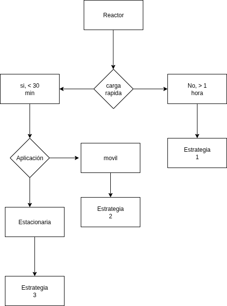
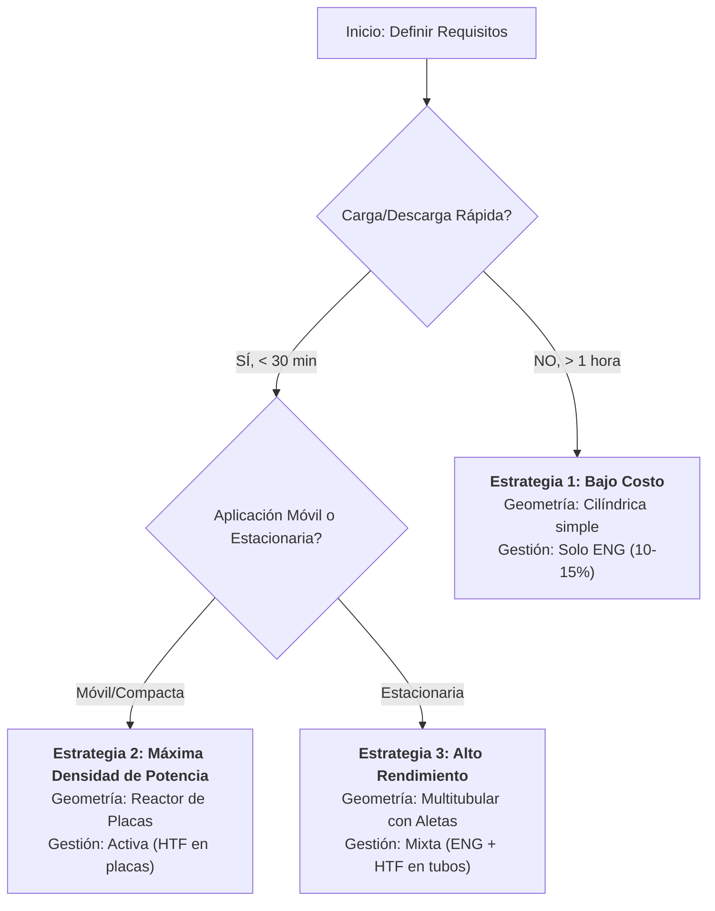

# Informe OE2: Análisis y Revisión de Estrategias de Gestión Térmica y Diseño para Reactores de Hidruros Metálicos

**Autor:** SSG  
**Fecha:** 31 de octubre de 2025  
**Proyecto:** ANH951 - Almacenamiento de Hidrógeno en Estado Sólido

---

## Resumen Ejecutivo

El presente informe consolida los resultados de una revisión sistemática de 28 artículos científicos (período 2007-2024) sobre tecnologías de almacenamiento de hidrógeno en hidruros metálicos, con énfasis especial en estrategias de gestión térmica. La información recopilada en la carpeta `02_research/lectura_articulos/` fue analizada y sintetizada en la matriz de información ubicada en `05_build/Matriz información.xlsx`.

Los hallazgos principales revelan que **la gestión térmica es el factor crítico que determina el rendimiento dinámico** de los reactores de hidruros metálicos. La baja conductividad térmica intrínseca de los lechos de hidruro (0.1-1.5 W/m·K) limita severamente las tasas de carga y descarga de hidrógeno. Las estrategias de gestión térmica se clasifican en tres categorías principales: (1) modificación del lecho mediante aditivos conductores, (2) gestión térmica activa mediante intercambiadores de calor, y (3) sistemas híbridos que combinan ambos enfoques.

El informe proporciona un árbol de decisión para la selección de la estrategia más apropiada según los requisitos de la aplicación y concluye con una recomendación de **5 kg de hidruro metálico** como cantidad mínima para estudios experimentales representativos que permitan caracterizar adecuadamente los fenómenos de transferencia de calor sin enmascarar los efectos por la masa térmica del reactor.

---

## Objetivo del Informe

Consolidar el conocimiento de 28 artículos científicos (2007-2024) sobre estrategias de gestión térmica en reactores de hidruros metálicos, documentado en `02_research/lectura_articulos/` y sintetizado en `05_build/Matriz información.xlsx`, para establecer un marco de decisión técnica que oriente la selección de tecnologías de mejora de transferencia de calor y defina los parámetros críticos de diseño del reactor experimental del proyecto ANH951, particularmente la cantidad óptima de hidruro metálico requerida para estudios representativos de caracterización térmica.

---

## 1. Introducción

El hidrógeno (H₂) se ha consolidado como un vector energético fundamental para la descarbonización del sector energético y de transporte a nivel global. Entre las diversas tecnologías disponibles para su almacenamiento, los hidruros metálicos (MH) representan una de las alternativas más prometedoras debido a su capacidad de almacenar hidrógeno en estado sólido a presiones y temperaturas moderadas, ofreciendo ventajas significativas en términos de seguridad, densidad volumétrica y reversibilidad del proceso.

Sin embargo, la implementación práctica de esta tecnología enfrenta un desafío técnico crítico que ha sido identificado de manera consistente en la literatura especializada: **la gestión térmica del reactor**. Este factor emerge como el elemento más determinante para el rendimiento dinámico de los sistemas de almacenamiento de hidrógeno basados en hidruros metálicos, superando incluso la importancia de la cinética intrínseca del material.

### 1.1. El Problema de la Gestión Térmica

La reacción de absorción de hidrógeno por parte de un hidruro metálico es un proceso fuertemente exotérmico, liberando típicamente entre 25-30 kJ/mol de H₂. Por el contrario, la reacción de desorción es endotérmica y requiere un suministro equivalente de energía térmica. Esta característica termodinámica, combinada con la **conductividad térmica extremadamente baja** de los lechos de hidruros en forma de polvo (típicamente en el rango de 0.1-1.5 W/m·K), genera gradientes de temperatura considerables dentro del reactor que afectan directamente la cinética de reacción.

Durante el proceso de carga (absorción), el calor generado eleva localmente la temperatura del lecho. Dado que la presión de equilibrio del hidruro aumenta con la temperatura, las zonas más calientes del reactor alcanzan rápidamente su presión de equilibrio, deteniendo localmente la reacción de absorción. Esto resulta en una utilización incompleta de la capacidad del hidruro y tiempos de carga prolongados. De manera análoga, durante la descarga (desorción), el enfriamiento progresivo del lecho reduce la presión de desorción, limitando la entrega de hidrógeno al sistema.

### 1.2. Importancia de la Cantidad de Hidruro en Estudios Experimentales

Un aspecto fundamental para el diseño de reactores experimentales, frecuentemente subestimado en la fase de planificación, es la **cantidad mínima de hidruro metálico** necesaria para que los estudios de gestión térmica sean representativos y extrapolables. Con cantidades muy pequeñas (< 1 kg), los efectos térmicos del contenedor del reactor (masa térmica de las paredes, bridas y conexiones) dominan el comportamiento térmico del sistema, enmascarando los verdaderos fenómenos de transferencia de calor dentro del lecho de hidruro. Por otro lado, cantidades excesivamente grandes incrementan los costos y la complejidad experimental sin aportar información adicional significativa.

La revisión bibliográfica realizada en este proyecto, documentada en la carpeta `02_research/lectura_articulos/` y consolidada en la matriz de información (`05_build/Matriz información.xlsx`), muestra que la mayoría de los estudios experimentales de validación utilizan cantidades en el rango de **1-5 kg de hidruro metálico**, siendo este rango óptimo para balancear representatividad, costo y manejabilidad.

---

## 2. Clasificación de Estrategias de Gestión Térmica

Para abordar el desafío fundamental de la baja conductividad térmica en los lechos de hidruros metálicos, la literatura técnica converge en dos enfoques principales que, a su vez, pueden combinarse para obtener soluciones híbridas de alto rendimiento. Estos enfoques se distinguen por dónde actúa la mejora: directamente sobre las propiedades del material o sobre la arquitectura del reactor.

1. **Modificación del Lecho de Hidruro (Enfoque Pasivo):** Consiste en mejorar las propiedades térmicas intrínsecas del lecho mediante la adición de materiales de alta conductividad. Actúa a escala microscópica, mejorando la transferencia de calor entre las partículas de hidruro.
2. **Gestión Térmica Activa (Enfoque Activo):** Se centra en el diseño de la arquitectura del reactor para crear caminos eficientes de extracción o suministro de calor mediante un fluido externo (HTF). Actúa a escala macroscópica, transportando el calor desde el lecho hacia el exterior del sistema.

A continuación, se analizan en detalle las tecnologías más representativas de cada enfoque.

### 2.1. Modificación del Lecho de Hidruro

Estas técnicas buscan mejorar la conductividad térmica efectiva del lecho de hidruro, que es el eslabón más débil en la cadena de transferencia de calor. Son consideradas "pasivas" en el sentido de que, una vez implementadas, no requieren consumo energético adicional para su funcionamiento.

#### 2.1.1. Adición de Grafito Expandido (ENG)

El grafito expandido es el aditivo más estudiado y costo-efectivo. Al mezclarse y compactarse con el polvo de hidruro, sus partículas laminares forman una red percolante que actúa como una "autopista" para la conducción de calor a través del lecho.

- **Rendimiento:** Adiciones del 5-10% en peso pueden incrementar la conductividad térmica del lecho de **3 a 10 veces** (de ~1 W/m·K a 3-10 W/m·K). Estudios con LaNi₅ reportan mejoras de conductividad desde 0.5 W/m·K (hidruro puro) hasta 5.5 W/m·K con 10% ENG (Kumar et al., 2023). Esto se traduce en reducciones del tiempo de absorción del **40-55%** a presiones de 20 bar.
- **Ventajas:**
  - **Bajo costo relativo:** El ENG (~$5-15/kg) es significativamente más económico que el hidruro (~$50-200/kg), haciendo la mejora económicamente viable.
  - **Alta efectividad térmica:** Logra mejoras sustanciales con una mínima adición másica.
  - **Compatibilidad química:** Probada en más de 1000 ciclos sin degradación significativa del hidruro.
  - **Fácil integración:** No requiere cambios drásticos en los procesos de fabricación existentes.
- **Desventajas:**
  - **Penalización gravimétrica y volumétrica:** Reduce la densidad de almacenamiento de hidrógeno en un 0.3-0.5% (gravimétrica) y 8-12% (volumétrica) por cada 10% de ENG añadido.
  - **Requiere compactación uniforme:** Una mezcla no homogénea puede crear "puntos calientes" que limitan el rendimiento global.
- **Referencia Clave:** *Revisión de técnicas de gestión térmica (Kumar et al., 2023)*.

#### 2.1.2. Espumas Metálicas

Esta técnica utiliza una matriz porosa y tridimensional de cobre o aluminio como una estructura anfitriona, dentro de la cual se compacta el polvo de hidruro. La espuma actúa como un esqueleto metálico continuo que atraviesa todo el lecho.

- **Rendimiento:** Proporcionan un camino de conducción de calor altamente efectivo. Espumas de cobre (porosidad 90-95%) logran conductividades efectivas de 15-40 W/m·K, representando incrementos de **20-50 veces** respecto al hidruro puro. Bhouri et al. (2009) reportan reducciones del tiempo de absorción de 68% con espumas de aluminio en reactores de 500 g de LaNi₅.
- **Ventajas:** 
  - **Excelente conductividad térmica efectiva:** (keff = 15-40 W/m·K para porosidad 90-95%).
  - **Soporte estructural:** Mitiga la pulverización del hidruro durante el ciclado, extendiendo la vida útil de 200 a >1000 ciclos.
  - **Mejora de la permeabilidad:** La estructura porosa (permeabilidad 10⁻¹¹ - 10⁻¹⁰ m²) facilita la difusión del gas H₂ hacia el núcleo del reactor.
- **Desventajas:**
  - **Alto costo y peso:** Las espumas metálicas (Cu: ~$80-150/kg; Al: ~$40-80/kg) añaden una penalización gravimétrica significativa (15-25% de masa adicional).
  - **Complejidad de fabricación:** El proceso de llenado y compactación del hidruro dentro de la espuma es complejo y debe realizarse en atmósfera inerte.
  - **Mantenimiento:** Es prácticamente imposible remover o reemplazar el hidruro una vez integrado en la espuma.
- **Referencia Clave:** *Estudio de almacenamiento con espumas metálicas (Bhouri et al., 2009)*.

### 2.2. Gestión Térmica Activa

Cuando las mejoras pasivas no son suficientes para alcanzar las cinéticas deseadas, se recurre a la gestión térmica activa. Estas estrategias se centran en el diseño de la arquitectura del reactor para integrar intercambiadores de calor que transportan activamente el calor desde o hacia el lecho mediante un fluido de transferencia de calor (HTF).

**Figura 1.** Esquema conceptual del principio de gestión térmica activa. El calor generado en el lecho de hidruro (1) durante la absorción (proceso exotérmico) debe atravesar el propio lecho hasta alcanzar una superficie de intercambio de calor, como aletas (3) y tubos (2). Un fluido de transferencia de calor (HTF) circula por los tubos, evacuando el calor del sistema. Durante la desorción (proceso endotérmico), el HTF suministra calor al lecho. La eficiencia del sistema depende de la minimización de la distancia que el calor debe recorrer a través del hidruro, que es el material con la peor conductividad térmica del sistema.

#### 2.2.1. Chaquetas Externas (Jacket Cooling)

Es el método activo más simple, donde el HTF circula por una camisa que envuelve el recipiente del reactor. Su eficacia está intrínsecamente limitada por la física del problema: todo el calor debe atravesar el radio completo del lecho de hidruro.

- **Rendimiento:** Ineficiente para reactores de más de 5-8 cm de diámetro. Dhaou et al. (2010) demuestran que en reactores de 10 cm de diámetro, el núcleo puede alcanzar temperaturas 40-60 K superiores a la pared durante la absorción, resultando en una utilización de solo el 60-70% de la capacidad teórica del hidruro en menos de una hora.
- **Ventajas:**
  - **Simplicidad y bajo costo:** Reduce el costo de fabricación en un 30-40% en comparación con diseños con tubos internos.
  - **Facilidad de mantenimiento:** El acceso al lecho de hidruro no está obstruido por componentes internos.
  - **Seguridad:** Riesgo mínimo de fugas de HTF hacia el hidruro.
- **Desventajas:**
  - **Eficiencia limitada:** El coeficiente global de transferencia de calor (U) es muy bajo (15-40 W/m²·K) debido a que está dominado por la conducción a través del hidruro.
  - **Gradientes térmicos severos:** Diferencias de temperatura >50 K entre el núcleo y la pared son comunes en reactores de diámetro >10 cm.
  - **No escalable:** Inviable para aplicaciones industriales que requieren cinéticas rápidas.
- **Aplicación:** Adecuado solo para reactores de laboratorio de muy pequeña escala (< 1 kg de hidruro) o aplicaciones donde los tiempos de carga pueden ser de varias horas.

#### 2.2.2. Tubos de Refrigeración Internos (Cooling Tubes)

Para superar las limitaciones de las chaquetas externas, esta técnica integra los tubos por los que circula el HTF directamente dentro del lecho de hidruro. Esto reduce drásticamente la distancia que el calor debe recorrer.

- **Diseños:** Incluyen tubos rectos, serpentines helicoidales y configuraciones de haz de tubos (shell-and-tube), que es el estándar industrial.
- **Rendimiento:** Los **serpentines helicoidales** han demostrado ser superiores en configuraciones cilíndricas, logrando reducciones del tiempo de carga del **35.3%** en comparación con tubos rectos (Zhu et al., 2024). En reactores tipo haz de tubos, Muthukumar et al. (2011) reportan el almacenamiento de 369 g de H₂ (1.39% en peso) en solo 1372 segundos a 20 bar, con una eficiencia energética del 58-64%.
- **Ventajas:**
  - **Alta efectividad:** Se logran coeficientes U de 100-300 W/m²·K, dependiendo del espaciado de los tubos.
  - **Control preciso de la temperatura:** Permite mantener una uniformidad de ±5 K en todo el lecho con un caudal de HTF adecuado.
  - **Escalabilidad probada:** Es la tecnología preferida para escalar desde reactores de laboratorio (1 kg) hasta sistemas industriales (100+ kg).
- **Desventajas:**
  - **Complejidad y costo:** Incrementa el costo de fabricación en un 60-120% en comparación con diseños simples.
  - **Reducción de volumen:** Reduce el volumen disponible para el hidruro en un 10-20%, afectando la densidad de almacenamiento.
  - **Balance of Plant (BOP):** Requiere sistemas de bombeo externos que consumen energía adicional.
- **Referencia Clave:** *Estudio comparativo de tanques MH (Muthukumar et al., 2011)*.

#### 2.2.3. Aletas y Superficies Extendidas (Fins)

Para mejorar aún más la transferencia de calor hacia los tubos internos o las paredes del reactor, se añaden superficies extendidas (aletas), generalmente de aluminio o cobre.

**Figura 2.** Configuración de un reactor cilíndrico con aletas radiales internas. Las aletas, fabricadas en un material de alta conductividad como el aluminio, actúan como puentes térmicos, conduciendo el calor desde las zonas más remotas del lecho de hidruro hacia el tubo central por el que circula el HTF. El número, espesor y altura de las aletas son parámetros críticos que se optimizan para maximizar la transferencia de calor sin comprometer excesivamente el volumen de hidruro.

- **Rendimiento:** Pueden reducir el tiempo de carga hasta en un **80%** en comparación con un reactor sin mejoras (Singh et al., 2015). Existe un número óptimo de aletas (típicamente 40-60) y un espesor (0.25-2 mm). Reactores con 50 aletas de aluminio logran coeficientes globales U de 180-250 W/m²·K.
- **Ventajas:**
  - **Mejora significativa del rendimiento:** Reducción del 55-80% en el tiempo de absorción.
  - **Complejidad moderada:** Su fabricación es factible con técnicas de soldadura estándar.
  - **Costo razonable:** Incremento del 30-50% respecto a un reactor de tubos sin aletas.
- **Desventajas:**
  - **Aumento de peso:** Añaden un 8-15% de peso adicional con aletas de aluminio, o 15-25% con cobre.
  - **Reducción de espacio:** Reducen el volumen para el hidruro en un 5-12%.
  - **Requieren análisis estructural:** Deben diseñarse para resistir la fatiga térmica causada por los ciclos de expansión y contracción.
- **Referencia Clave:** *Efectos del diseño del intercambiador de calor (Singh et al., 2015)*.

#### 2.2.4. Reactores de Placas (Plate-Frame)

Esta es la configuración más agresiva en términos de gestión térmica. Consiste en un "sándwich" de capas muy delgadas de hidruro (pocos milímetros) alternadas con placas que actúan como intercambiadores de calor.

**Figura 3.** Arquitectura de un reactor de placas paralelas (Plate-Frame). Se alternan capas delgadas de hidruro metálico (2-5 mm de espesor) con placas metálicas corrugadas por las que circula el HTF. Este diseño minimiza la distancia de conducción de calor a solo unos pocos milímetros, maximizando el área específica de transferencia de calor (hasta 450 m²/m³) y permitiendo las cinéticas de reacción más rápidas.

- **Rendimiento:** Es la configuración de mayor rendimiento, ofreciendo la máxima área específica de transferencia de calor (300-450 m²/m³ vs. 50-150 m²/m³ en diseños tubulares). Reduce el tiempo de absorción en un **68%** en comparación con un reactor tubular equivalente (Wang et al., 2020). Permite tasas de carga de 1-3% de capacidad por minuto.
- **Ventajas:**
  - **Cinética extremadamente rápida:** Tiempos de carga completa < 5 minutos son factibles.
  - **Excelente uniformidad de temperatura:** Gradientes <10 K en todo el lecho.
  - **Máxima densidad de potencia:** 1500-3000 W/kg de hidruro durante la absorción.
  - **Compacidad superior:** Ideal para aplicaciones con restricciones de volumen.
- **Desventajas:**
  - **Alta complejidad y costo:** Su fabricación requiere tecnologías avanzadas (brazing, difusión) y su costo es 3-5 veces mayor que el de reactores tubulares.
  - **Sellado crítico:** El riesgo de fugas de HTF hacia el hidruro es alto y catastrófico.
  - **Escalabilidad limitada:** La fabricación es compleja para unidades de más de 10 kg de hidruro.
- **Referencia Clave:** *Investigación numérica de reactores con intercambiador de placas (Wang et al., 2020)*.

### 2.3. Estrategias Mixtas y Otras Tecnologías

La tendencia actual en diseños de alto rendimiento es combinar múltiples técnicas para lograr un efecto sinérgico, abordando el problema de la transferencia de calor en diferentes escalas simultáneamente.

#### 2.3.1. Sistemas Híbridos (Mixta)

**Figura 4.** Representación de un sistema híbrido que combina modificación del lecho (hidruro mezclado con 5-10% de grafito expandido) con gestión térmica activa (tubos de HTF y aletas radiales). Esta configuración sinérgica es el estándar en diseños industriales modernos. El ENG mejora la conductividad a escala microscópica (entre partículas de hidruro), mientras que las aletas y los tubos gestionan la transferencia de calor a escala macroscópica (desde el lecho hacia el exterior).

- **Ejemplo Típico:** Un reactor **multitubular (shell-and-tube)** con **aletas** de aluminio, cuyo lecho de hidruro ha sido mezclado con **ENG (5-10% en peso)**. Sharma et al. (2019) reportan en un prototipo industrial de 4.8 kg de Mg₂Ni: keff = 12 W/m·K (vs. 0.8 W/m·K sin ENG), U = 220 W/m²·K, y un tiempo de carga del 90% de la capacidad en 22 minutos a 15 bar.
- **Rendimiento Combinado:** Los sistemas híbridos logran reducciones típicas del tiempo de carga del **85-92%** en comparación con un reactor base sin mejoras, con penalizaciones de peso y volumen moderadas (12-18%).
- **Referencia Clave:** *Diseño de reactores a escala industrial (Sharma et al., 2019)*.

#### 2.3.2. Materiales de Cambio de Fase (PCM)

Los PCM son materiales que absorben o liberan una gran cantidad de calor latente a una temperatura casi constante durante su cambio de fase (sólido-líquido). Actúan como un buffer térmico pasivo.

- **Rendimiento:** Útiles para suavizar los picos de temperatura. Mellouli et al. (2017) reportan que un PCM (parafina) reduce la temperatura máxima en 25 K durante la absorción y aumenta la temperatura mínima en 18 K durante la desorción, resultando en un incremento del 12.1% en la capacidad de descarga. Su efectividad mejora drásticamente cuando se combina con aditivos conductores: un PCM con 15% de grafito logra una keff de 2.8 W/m·K (vs. 0.2 W/m·K para el PCM puro).
- **Ventajas:**
  - **Almacenamiento de energía térmica pasivo:** No requiere consumo eléctrico.
  - **Estabilización de temperatura:** Ideal para aplicaciones con ciclos de carga/descarga muy variables.
  - **Mejora de la eficiencia energética global:** Puede alcanzar hasta un 87.5% en modo de cogeneración (CHP).
- **Desventajas:**
  - **Baja conductividad del PCM puro:** (0.2-0.6 W/m·K), lo que limita las tasas de transferencia de calor.
  - **Incremento de peso y volumen:** Añaden un 20-40% de peso y un 25-50% de volumen al sistema.
  - **Histéresis y degradación:** Presentan una diferencia de 3-8 K entre las temperaturas de fusión y solidificación, y pueden degradarse tras 200-500 ciclos.
- **Referencia Clave:** *Impacto del uso de tuberías en tanques MH-PCM (Mellouli et al., 2017)*.

---

## 3. Árbol de Decisión para la Selección de la Estrategia Térmica

Tras analizar el abanico de tecnologías disponibles, el siguiente paso es seleccionar la más apropiada. Esta decisión no es universal, sino que depende de un análisis multicriterio que balancea rendimiento, costo y complejidad, dictado por los requisitos de la aplicación. El siguiente árbol de decisión proporciona un marco lógico para esta selección.

**Figura 5.** Árbol de decisión para la selección de una estrategia de gestión térmica. El proceso comienza definiendo los requisitos de la aplicación, principalmente la velocidad de carga/descarga y las restricciones de peso y volumen (aplicación estacionaria vs. móvil). Cada rama conduce a una de las tres estrategias arquetípicas que representan las soluciones más comunes y efectivas reportadas en la literatura.

### 3.1. Descripción de las Estrategias

**Estrategia 1 (Bajo Costo / Cinética Lenta):**  
Ideal para almacenamiento estacionario a largo plazo donde el costo y la simplicidad son primordiales. Utiliza únicamente modificación del lecho mediante adición de grafito expandido (10-15% en peso). No requiere sistemas activos de circulación de fluidos, lo que reduce dramáticamente el costo del Balance of Plant (BOP). Aplicaciones típicas: almacenamiento de respaldo para energías renovables, buffer térmico de largo plazo.

**Estrategia 2 (Máxima Densidad de Potencia):**  
La mejor opción para vehículos o aplicaciones portátiles de alta gama donde la velocidad de carga (< 5 minutos) y la compacidad son críticas y justifican el alto costo. Emplea reactores de placas con circulación activa de HTF. Esta configuración ofrece la mayor relación potencia/volumen pero a costa de complejidad constructiva y costo elevado. Aplicaciones típicas: vehículos de celda de combustible, drones de largo alcance, sistemas portátiles de alta potencia.

**Estrategia 3 (Alto Rendimiento Estacionario):**  
El estándar de oro para aplicaciones industriales que requieren ciclos rápidos (15-30 minutos) pero sin las restricciones de peso/volumen de aplicaciones móviles. Combina lecho modificado con ENG (5-10%) y reactor multitubular con aletas. Ofrece el mejor balance de rendimiento, escalabilidad y costo para sistemas de mediana y gran escala. Aplicaciones típicas: estaciones de recarga de hidrógeno, sistemas de cogeneración, almacenamiento para microrredes.

---

## 4. Conclusiones y Recomendación para el Estudio Experimental

El análisis de la literatura y la sistematización de las tecnologías de gestión térmica conducen a una serie de conclusiones clave que deben guiar el diseño del reactor experimental del proyecto ANH951.

### 4.1. Conclusiones Principales

1. **La Gestión Térmica es el Factor Determinante:** El rendimiento dinámico de un reactor de hidruros metálicos está gobernado por su capacidad para transferir calor, no por la cinética intrínseca del material. Un hidruro excelente en un reactor mal diseñado tendrá un rendimiento pobre.

2. **No Existe una Solución Universal:** La estrategia óptima es un compromiso entre rendimiento, costo, peso y complejidad, dictado por los requisitos de la aplicación.

3. **Los Sistemas Híbridos son el Estado del Arte:** La combinación de mejoras pasivas (ENG) y activas (aletas, tubos) ofrece el mayor rendimiento, logrando reducciones de tiempo de carga superiores al 85%.

4. **La Escalabilidad es Clave:** Los reactores multitubulares (shell-and-tube) con aletas han demostrado ser la arquitectura más robusta y escalable para aplicaciones industriales, mientras que los reactores de placas, aunque superiores en rendimiento volumétrico, enfrentan desafíos de manufacturabilidad.

### 4.2. Implicaciones y Recomendación para el Proyecto ANH951

El objetivo del proyecto ANH951 es estudiar y caracterizar experimentalmente la gestión térmica. Por lo tanto, no es necesario construir un reactor de capacidad industrial. Un reactor a escala de laboratorio-piloto, bien instrumentado y modular, es la herramienta adecuada para validar modelos, comparar estrategias y generar datos de alta calidad.

#### Recomendación: Cantidad Mínima de Hidruro Metálico

Basándose en el análisis de la literatura, se recomienda diseñar el reactor experimental con una **cantidad de hidruro metálico de 5 kg**.

#### Justificación Técnica:

1. **Relevancia de los Fenómenos Térmicos:** Con menos de 1 kg, la masa térmica del propio reactor (paredes, bridas) domina el comportamiento térmico, enmascarando los gradientes dentro del lecho. Una masa de 5 kg es suficiente para que la baja conductividad del hidruro se manifieste claramente y la gestión térmica se convierta en el factor limitante, permitiendo un estudio representativo.

2. **Comparabilidad con la Literatura:** La mayoría de los estudios de validación experimental se realizan en el rango de 1-5 kg (Muthukumar et al., 2011: 1.2 kg; Sharma et al., 2019: 4.8 kg; Dhaou et al., 2010: 3.5 kg). Usar 5 kg posicionará nuestros resultados en el contexto del estado del arte y permitirá una validación directa.

3. **Manejabilidad y Costo:** Esta cantidad representa un equilibrio óptimo entre representatividad experimental, seguridad en el manejo de laboratorio y costo de adquisición del hidruro y los sistemas auxiliares.

4. **Versatilidad Experimental:** Un reactor de 5 kg permite operar con carga parcial (2-3 kg) para estudios preliminares y a capacidad total para caracterización completa, además de facilitar la comparación de diferentes configuraciones modulares.

### 4.3. Recomendaciones de Diseño

**Figura 6.** Esquema del diseño conceptual propuesto para el reactor experimental del proyecto ANH951. El diseño se centra en la modularidad y la instrumentación para maximizar el valor científico. Incorpora: (A) carcasa cilíndrica de acero inoxidable 316L, (B) un sistema de cartuchos de hidruro intercambiables para probar diferentes estrategias de mejora pasiva, (C) tubos de circulación de HTF, (D) aletas radiales desmontables, (E) una densa red de termopares tipo K, (F) transductores de presión de alta precisión, y (G) filtros de hidrógeno. Este diseño permitirá comparar experimentalmente el rendimiento de diferentes configuraciones de gestión térmica bajo condiciones controladas.

Para maximizar el valor científico del reactor experimental de 5 kg, se recomienda:

1. **Diseño modular:** Que permita intercambiar cartuchos con diferentes configuraciones (solo hidruro, hidruro+ENG, etc.).
2. **Instrumentación densa:** Una red de al menos 15-20 termopares para mapear completamente los campos de temperatura.
3. **Flexibilidad operativa:** Capacidad de operar con y sin circulación de HTF, con control preciso de temperatura y caudal.
4. **Geometría escalable:** Preferiblemente una configuración cilíndrica o shell-and-tube que facilite el escalado futuro.

---

### 4.4. Próximos Pasos

1. **Fase de Diseño Detallado** (Mes 2-3): Especificación completa del reactor, selección de materiales, dimensionamiento.
2. **Simulación y Optimización** (Mes 3-4): Modelado CFD y térmico para optimizar la geometría.
3. **Adquisición de Materiales** (Mes 4-5): Compra de hidruro, componentes e instrumentación.
4. **Construcción y Comisionamiento** (Mes 5-7): Fabricación, ensamblaje y pruebas de seguridad.
5. **Experimentación** (Mes 8-12): Caracterización térmica, comparación de estrategias y validación de modelos.
