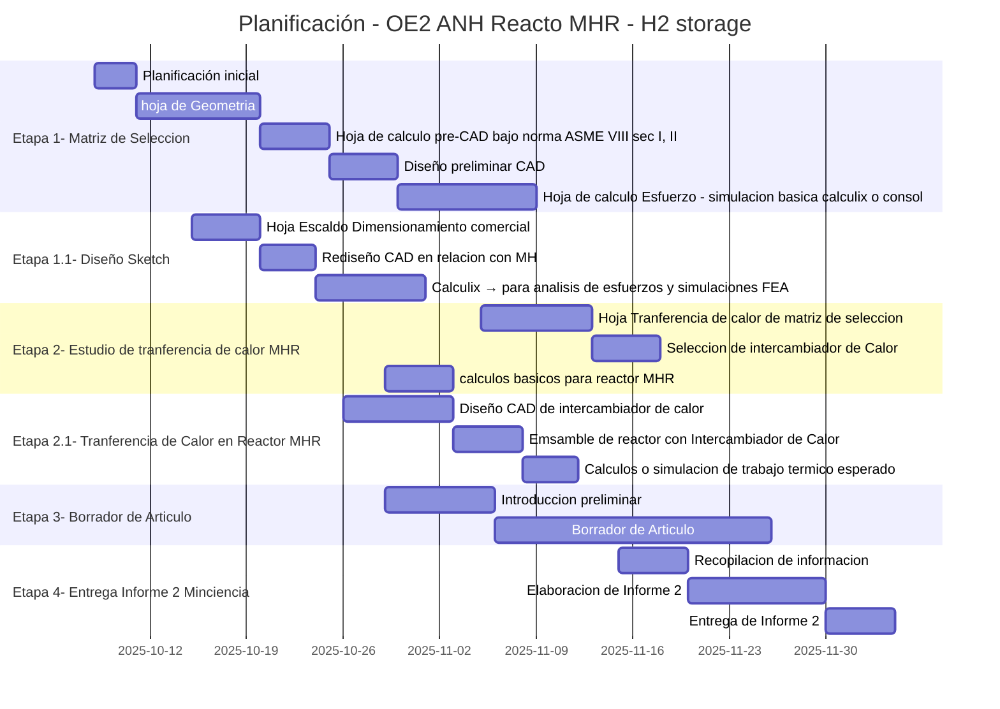

# Diagrama de Gantt

```mermaid
gantt
    title Planificación - OE2 ANH Reacto MHR - H2 storage
    dateFormat  YYYY-MM-DD
    section Etapa 1- Matriz de Seleccion
    Planificación inicial               :a1, 2025-10-08, 3d
    hoja de Geometria: a2, after a1, 9d
    Hoja de calculo pre-CAD bajo norma ASME VIII sec I, II: a3, after a2, 5d
    Diseño preliminar CAD  : a4, after a3, 5d
    Hoja de calculo Esfuerzo - simulacion basica calculix o consol : a5, after a4, 10d
    
    

    section Etapa 1.1- Diseño Sketch 
    Hoja Escaldo Dimensionamiento comercial        :b1, 2025-10-15, 5d
    Rediseño CAD en relacion con MH  :b2, after b1, 4d
    Calculix → para analisis de esfuerzos  y simulaciones FEA       :b3, after b2, 8d
        

    section Etapa 2- Estudio de tranferencia de calor MHR
    Hoja Tranferencia de calor  de matriz de seleccion      :c1, 2025-11-05, 8d
    Seleccion de intercambiador de Calor      :c2, after c1, 5d    
    calculos basicos para reactor MHR    :c3, 2025-10-29, 5d

    section Etapa 2.1- Tranferencia de Calor en Reactor MHR
    Diseño CAD de intercambiador de calor :d1, 2025-10-26, 8d
    Emsamble de reactor con Intercambiador de Calor          :d2, after d1, 5d
    Calculos o simulacion de trabajo termico esperado           :d3, after d2, 4d

    section Etapa 3- Borrador de Articulo
    Introduccion preliminar :e1, 2025-10-29, 8d
    Borrador de Articulo :e2, after e1, 20d
    

    section Etapa 4- Entrega Informe 2 Minciencia 
    Recopilacion de informacion :f1, 2025-11-15, 5d
    Elaboracion de Informe 2  :f2, after f1, 10d
    Entrega de Informe 2   :f3, after f2, 5d    
```
